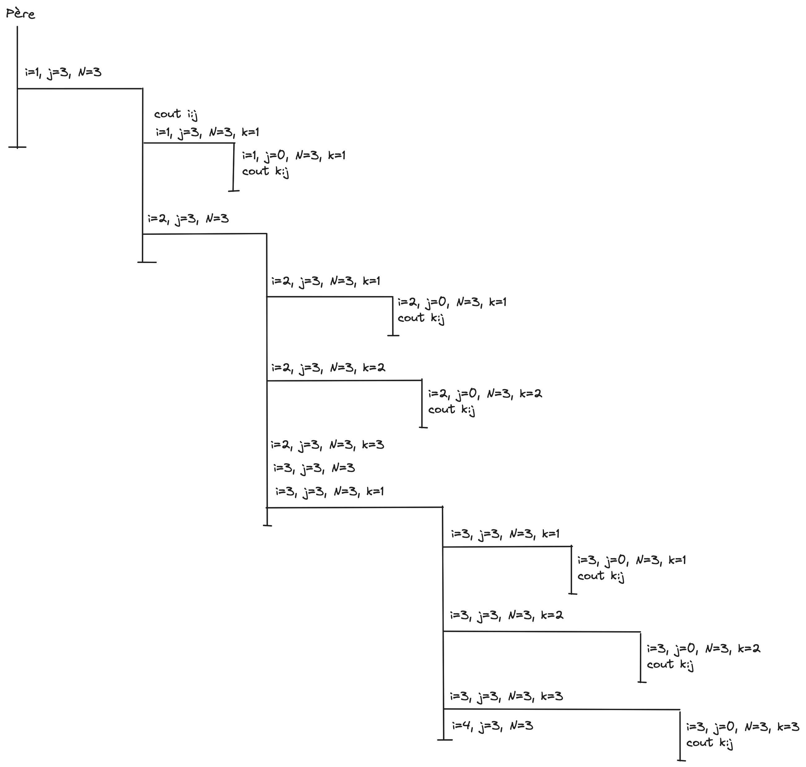

# tme6 : Processus, Fork, Signaux

Commencer par faire un "fork" du projet, puis travailler sur votre copie.

### Question 1
Il y a 10 processus.
```
main pid=6214
 i:j 1:3
 k:j 1:0
 i:j 2:3
 k:j 1:0
 k:j 2:0
 i:j 3:3
 k:j 1:0
 k:j 2:0
 k:j 3:0
```
